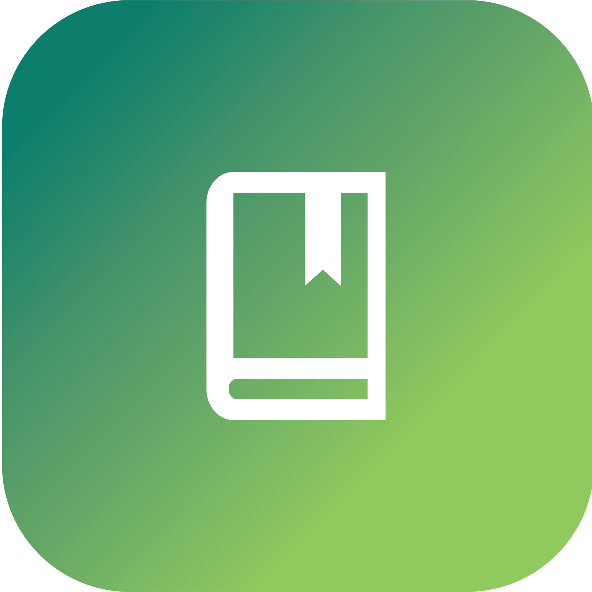

# Ecoflow

<p align="center">
  
</p>

Ecoflow is an application that aims to promote sustainable living by empowering users to take actions, learn, and track environmental data. The app provides users with an easy and interactive way to understand their carbon footprint and learn about the environmental impact of their daily activities.

Users can earn points by taking actions like reducing their carbon footprint, planting trees, recycling, and other eco-friendly activities. These points can be used to unlock new features or rewards within the app.

Ecoflow also provides users with access to local Air Quality Index (AQI) and global CO2 emissions data. Users can track changes in air quality and carbon emissions in real-time, which can help them make informed decisions about their daily activities.

In addition to taking actions and tracking environmental data, Ecoflow also allows users to post about their eco-friendly activities and share tips and advice with others in the community. This social aspect of the app allows users to connect with others who share their passion for sustainability and learn from each other's experiences.

Overall, Ecoflow aims to inspire and empower users to take action towards a more sustainable future.

<p align="center">
  
  
  
  
  
</p>

## Prerequisites
To run the Ecoflow app, you'll need to have the following installed on your machine:

- Flutter SDK (version 2.0.0 or higher)
- Android Studio
- An Android device or emulator

## Getting started
To get started with Ecoflow, follow these steps:

### 1. Clone the repository by running the following command in your terminal:

```
git clone https://github.com/MrFDarcy/ecoflow.git
```

### 2. Change into the project directory:

```
cd ecoflow
```

### 3. Install the required dependencies:

```
flutter pub get
```

### 4. Run the app on your device or emulator:

```
flutter run
```

### If you want to run the app on a specific device or emulator, you can specify it using the -d flag. For example, to run the app on an Android emulator, you can run:

```
flutter run -d Nexus_5X_API_30
```
Replace emulator-5554 with the name of your emulator.
